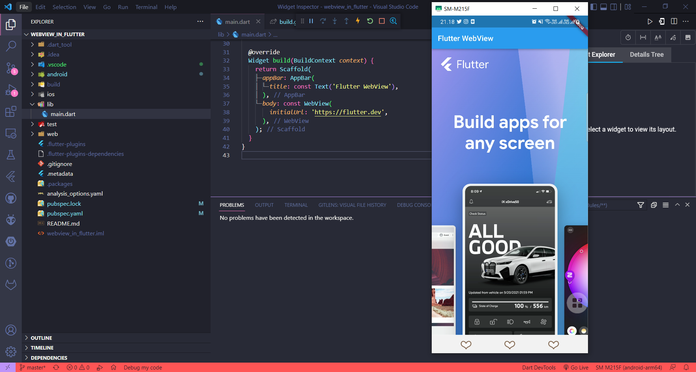
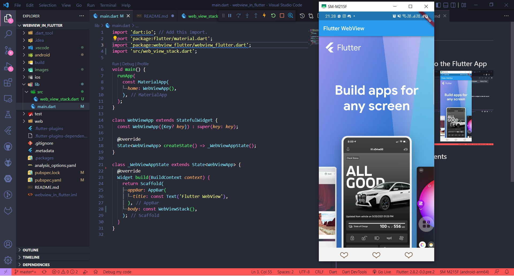
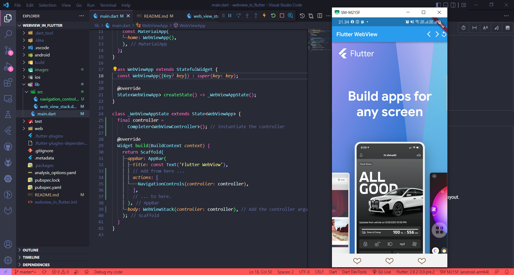
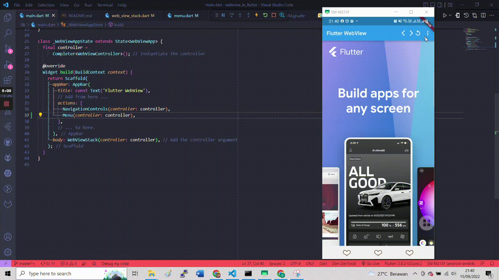
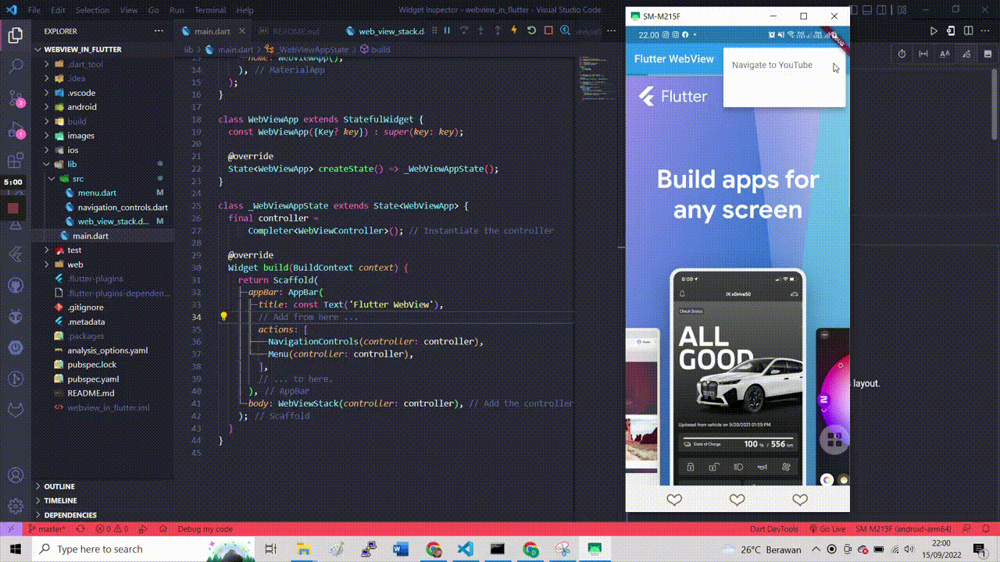
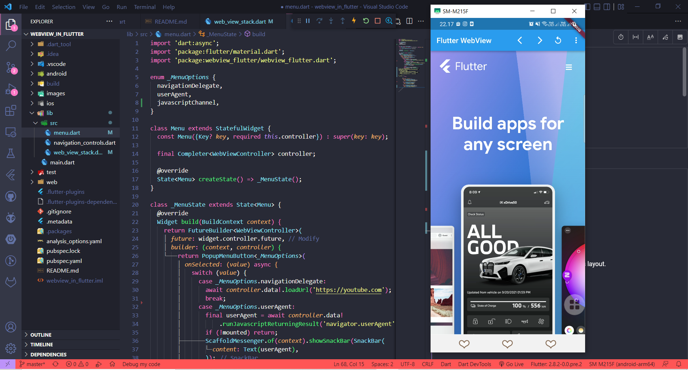

# webview_in_flutter

A new Flutter project.

## Adding WebView widget to the Flutter App

## Listening for page load events

## Working with the WebViewController

## Adding a menu button to the AppBar

## Evaluating JavaScript

## Working with JavaScript Channels for IP with json return

## Managing Cookies
